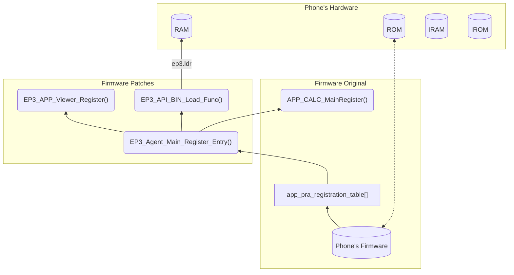
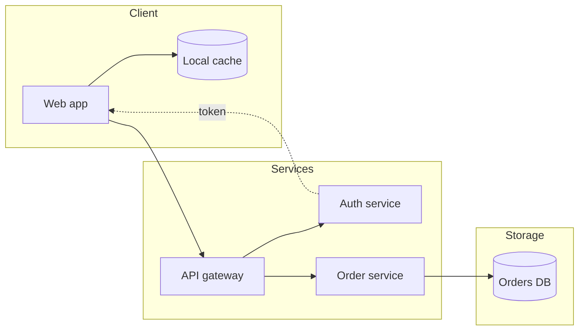
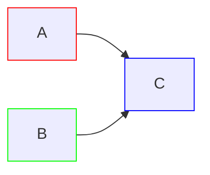
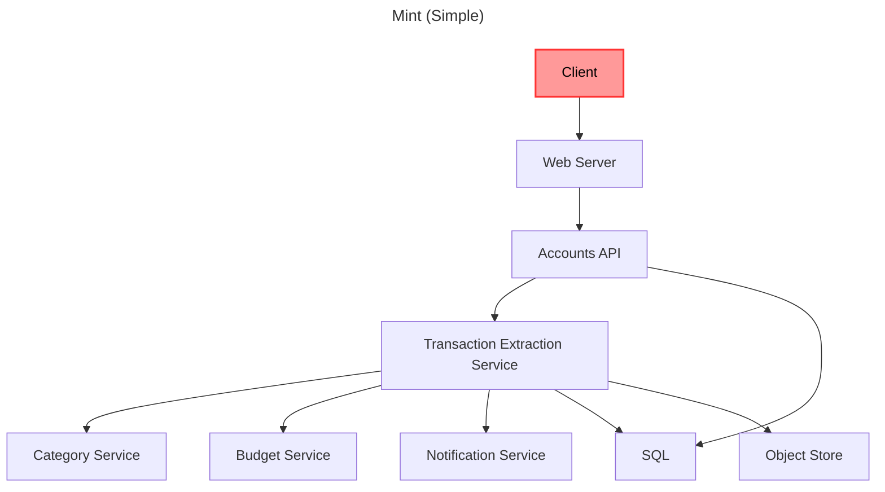

# ElfPack3 Architecture

```mermaid
flowchart BT
    subgraph Phone_Hardware [Phone's Hardware]
        direction TB
        RAM[(RAM)]
        ROM[(ROM)]
        IRAM[(IRAM)]
        IROM[(IROM)]
    end
    subgraph Original_Firmware [Firmware Original]
        direction TB
        Phones_Firmware[(Phone's Firmware)]
        Registration_Table["app_pra_registration_table[]"]
        Calculator_Register("APP_CALC_MainRegister()")
    end
    subgraph Firmware_Patches [Firmware Patches]
        direction TB
        EP3_Register("EP3_Agent_Main_Register_Entry()")
        APP_Viewer_Register("EP3_APP_Viewer_Register()")
        Bin_Loader("EP3_API_BIN_Load_Func()")
    end
    Phones_Firmware --> Registration_Table
    Phones_Firmware <-.-> ROM
    Registration_Table --> EP3_Register
    EP3_Register --> Calculator_Register
    EP3_Register --> APP_Viewer_Register
    EP3_Register --> Bin_Loader
    Bin_Loader -- ep3.ldr --> RAM
```

# Samples for copying

```mermaid
flowchart LR
    subgraph Client
        UI[Web app]
        Cache[(Local cache)]
    end
    subgraph Services
        API[API gateway]
        Auth[Auth service]
        Orders[Order service]
    end
    subgraph Storage
        DB[(Orders DB)]
    end
    UI --> API
    UI --> Cache
    API --> Auth
    API --> Orders
    Orders --> DB
    Auth -. token .-> UI
```

```mermaid
flowchart LR
    A:::foo & B:::bar --> C:::foobar
    classDef foo stroke:#f00
    classDef bar stroke:#0f0
    classDef foobar stroke:#00f
```

```mermaid
---
title: Mint (Simple)
---
graph TB
    Client --> web[Web Server] --> accounts[Accounts API]
    accounts --> tes[Transaction Extraction Service] --> category[Category Service] & budget[Budget Service] & notif[Notification Service]
    accounts --> db
    tes --> db[SQL]
    tes --> store[Object Store]

%% Style definitions below
    style Client fill:#ff9999,stroke:#ff3333,stroke-width:2px,color:#000
```
